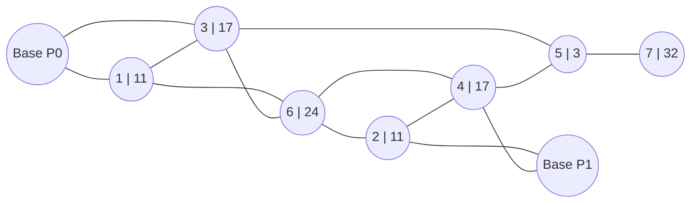

# Game Alpha

## Overview

Two players compete for demand on a fixed graph over a fixed number of turns. Each turn, both
players move drones between nodes; drones present at a node capture a share of that node's demand
proportional to the capacity they bring. Cumulative reward across the whole game decides the match.

## Map

The map is fixed and the same in every match. It is an undirected graph with 9 nodes. Each number
in a node label (`node | demand`) is the demand available at that node each turn.



| node | demand | role              |
|-----:|-------:|-------------------|
| 0    | 0      | base of player 0  |
| 1    | 11     |                   |
| 2    | 11     |                   |
| 3    | 17     |                   |
| 4    | 17     |                   |
| 5    | 3      |                   |
| 6    | 24     |                   |
| 7    | 32     |                   |
| 8    | 0      | base of player 1  |

Edges (undirected):

```
0–1  0–3  1–3  1–6  3–6  3–5  6–2  6–4  2–4  2–8  4–8  4–5  5–7
```

## Units

Each player has 20 drones, and all of them start at their base. Every drone has capacity 5.

## Turn order

Each turn, both players:

1. call `observe(player_id)` and get their observation for the current turn,
2. call `act(obs)` and submit a list of moves,
3. the engine applies both players' moves and pays out that turn's reward, then advances the turn.

Moves are simultaneous between players: a player only ever moves their own drones, so the order in
which the two players' moves are applied does not affect the outcome. Within one player's own move
list, moves are applied in order, so a later move can use drones freed up by an earlier one in the
same list.

The game ends after a fixed number of turns (see "End of game"); this number is not part of the
observation.

## Observation

Each turn your strategy's `act(obs)` receives a `dict`:

```python
{
    "turn": int,  # current turn, starting at 0
    "player_drones": list[int], # per node: number of your drones at that node
    "opponent_drones": list[int], # per node: number of opponent's drones at that node
    "player_reward_last_turn": float, # reward obtained by the player in the last turn
    "opponent_reward_last_turn": float, # reward obtained by the opponent in the last turn
    "player_cumulative_reward": float, # total reward obtained by the player so far
    "opponent_cumulative_reward": float,  # total reward obtained by the opponent so far
    "n_invalid_actions_last_turn": int, # number of invalid actions in the last turn
    "action_format_correct_last_turn": bool, # whether the action format was correct in the last turn
}
```

## Action

`act` returns a `list` of move tuples:

```python
[(from_node, to_node, count), ...]  # all three are int
```

- Each tuple moves `count` of your drones from `from_node` to `to_node`.
- An empty list means "do nothing".

Two things can go wrong with an action, and they are reported separately in next turn's
observation:

- **Malformed action** — not a list, or a move that isn't a 3-int tuple. The whole action is
  ignored for that turn (as if you'd sent `[]`), and `action_format_correct_last_turn` will be
  `False`.
- **Illegal move** — well-formed, but `from_node`/`to_node` aren't adjacent, or you don't have
  `count` drones at `from_node`. Only that move is skipped; the rest of the list still applies, and
  it's counted in `n_invalid_actions_last_turn`.

## Scoring

At every node, each player's drones there convert to capacity, and the node's demand is split
between the players in proportion to the capacity they brought:

```
capacity_i = drones_i * drone_capacity                       # drone_capacity = 5
served_i   = capacity_i * demand / max(total_capacity, demand)
```

`total_capacity` is the sum of both players' capacity at that node. This is equivalent to
`min(capacity_i, demand * capacity_i / total_capacity)`: if the node is contested but under-served,
each player gets their proportional share of demand; if it's over-supplied, each player is capped
at what their own capacity can serve. A node with no demand (both bases) or no drones from either
player contributes nothing. Reward is summed across all nodes and across the whole game; there is
no separate per-turn score to optimize beyond that sum.

## End of game

The game ends after a fixed number of turns (100). The player with the higher cumulative reward
wins; equal cumulative reward is a draw.
